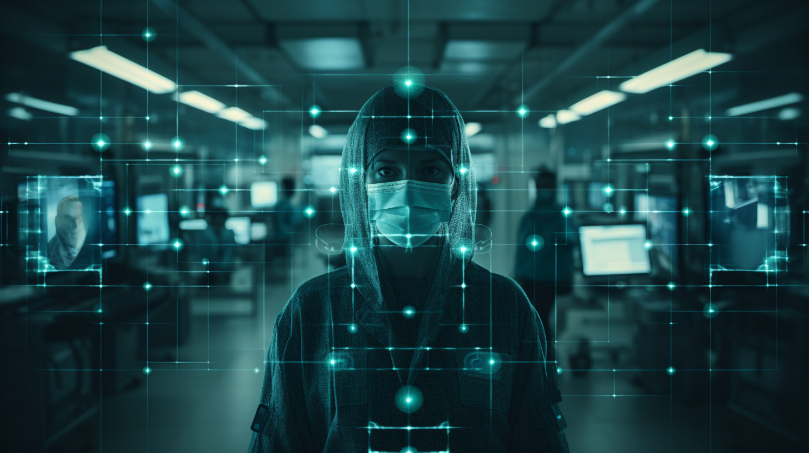

# Eksamen PGR301 2023

I et pulserende teknologisamfunn i Grünerløkka, Oslo, har en livlig oppstart ved navn 'VerneVokterne' begynt å utmeisle
sitt eget nisjeområde i helsesektoren. De utvikler banebrytende bildebehandlingsprogramvare designet for å sikre at
helsepersonell alltid bruker personlig verneutstyr (PPE). Med en pasjon for innovasjon og et brennende ønske om å
forbedre arbeidssikkerheten, samler 'VerneVokterne' et team av skarpe utviklere, engasjerte designere og visjonære
produktledere.

Som nyansatt, har du fått den utfordrende oppgaven å ta over etter "Kjell" som ikke lenger jobber i selskapet



# Oppgave Kjell's Python kode

Kjell var en kløpper til å kode Python, og kunne danse over tastaturet med en slik nåde at selv rubber
ducks (du vet, de som Devs snakker til når de er fastlåst) begynte å følge med. Hans mesterverk var kode som kunne
oppdage om mennesker på bilder har på seg ansiktsmaske, for eksempel på vei inn på en
arbeidsplass der påkrevet.

Dette ble laget ved hjelp av AWS Rekognition. Men så, på en helt vanlig tirsdag, etter å ha inntatt sin
tredje espresso, fikk Kjell et tilbud han ikke kunne avslå - å bli med i en startup, HiVis Holdings, som holder på med
et konkurrerende produkt.

Når du ser på arbeidet til Kjell, som ligger i dette repositoryet, vil det bli klart for deg at kjell var mer opptatt av
tempo en kvalitet.

Nå er det din tur til å ta over det arbeidet av tvilsom karaketer, og siden du ånder og lever for kontinuerlig
forbedring må du rydde opp i dette rotet av kode før noen kan tenke på å gjøre noe nytt med applikasjonen,
og ta opp konkurransen med HiVis Holding.

## Oppgave GitHub actions workflow

Koden er skrevet som en AWS SAM applikasjon, og ligger i mappen "kjell" i dette repoet. Det er åpenbart an har tatt
ugangspunkt i et "Hello World" SAM prosjekt og bare brukt navnet sitt som applikasjonsnavn.

* Hvis du sjekker ut koden i ditt Cloud9-miljø eller på en lokal maskin og har AWS SAM installert, kan du bygge og
  deploye koden til AWS. Det anbefales å teste dette før du fortsetter.

Oppgave

* Du skal opprette en GitHub Actions-arbeidsflyt for SAM applikasjonen. For hver commit til main branch, skal
  arbeidsflyten bygge og deploye Lambda-funksjonen.
* Som respons på en Merge Request, eller en push til en annen branch en main skal applikasjonen kun kompileres og
  bygges. Altså ingen deployment.
* Sensor vil lage en fork av ditt repository. Forklar hva sensor må gjør for å få GitHub Actions workflow til å kjøre i
  sin egen GitHub-konto.

## Docker container

Python er ikke et veldig etablert språk i selskapet ditt, så du vil gjerne at også utviklere som ikke har et Python
installert på sin maskin skal kunne bruke koden.

Oppgave

Lag en Dockerfile for python koden. Sensor skal kunne gjøre følgende kommando for å bygge og kjøre koden.
Du må fjerne hardkoding av bucketnavn i python koden, slik at vi kan sende verdien inn som en miljøvariabel.

Dockerfilen skal lages i mappen /kjell/hello_world

```shell
docker build -t kjellpy . 
docker run -e AWS_ACCESS_KEY_ID=XXX -e AWS_SECRET_ACCESS_KEY=YYY -e BUCKET_NAME=kjellsimagebucket kjellpy
```

Det ligger noen hint i app.py for hvordan Dockerfile kan lages.

## Overgang til Java og Spring boot

Du innser raskt at Python ikke er veien videre for et konkurransedyktig produkt og har laget et skall av en
Java-applikasjon  som ligger i dette repoet. Du ønsker allikevel å beholde Kjell sin kode en stund til for å se at den nye versjonen
basert på  Java fungerer identisk. Du skal derfor videre i oppgaven utvide workflowen dokumentet du allerede har laget med ekstra
jobber.

* Test applikasjonen lokalt i ditt cloud9 miljø med ```mvn spring-boot:run```,
* Du kan teste applikasjonen med ```curl localhost:8080/scan-ppe?bucketName=kjellsimagebucket``` og se på responsen

Oppgave

* Lag en GitHub actions workflow slik at hver commit på main branch lager og publiserer en et nytt Container image til
  et ECR repository. Du må selv lage et ECR repository i AWS miljøet, du trenger ikke automatisere dette.
* Oppgi hvilken kommando sensor kjøre fra sitt Cloud9 miljø for å starte container direkte fra ditt ECR repository? 

```shell
docker run .... 
```

## Terraform og Infrastruktur som kode

Se på koden som ligger i infra katalogen, den inneholder kun en app_runner_service og en IAM rolle som gjør denne i 
stand til å gjøre API kall mot AWS Rekognition. 
 
Oppgave 

* Fjern hardkodingen av service_name, slik at service_name kan settes lik ditt kandidatnummer
* Utvid din GitHub Actions workflow til å kjøre terraformkoden, etter jobben som lager container image av Java-applikasjonen


Oppgave

* Sensor skal kunne deploye infrastrukturen ved å kjøre terraform kommandoen

```
    terraform apply --auto-approve --var prefix=glenn --var bucket=<bucket name>
```

* Beskriv hvilke endringer Sensor må gjøre i sin GitHub Actions workflow for å kjøre sin egen versjon av infrastrukturen


## Feedback 

Vi har jobbet med å gjøre metrikker og målepunkter for applikasjonen vår synlige, og vi har også laget alarmer basert på metrikkene


Oppgave

* Gjør nødvendige endringer i Java-applikasjonen til å bruke Micrometer rammeverket for Metrics 
* Endre koden og lag en teller, en Gauge, og en Timer. Du velger selv hvordan du vil bruke de ulike måleinstrumentene. Begrunn valget ditt
* Fra Terraformkoden, lag et Dashboard som viser metrikkverdier. Du velger selv innhold men må begrunne valget ditt. 
*  Fra Terraformkoden, Lag en alarm, som varsler via Epost på kriterier du selv velger, Begrunn valget ditt

# Drøfteoppgaver

### Det Første Prinsippet - Flow

### Det Andre Prinsippet - Feedback

Oppgave: "Tenk deg at du har implementert en ny funksjonalitet i en applikasjon du jobber med. Beskriv hvordan du vil
etablere og bruke teknikker vi har lært frea "feedback" for å sikre at den nye funksjonaliteten møter brukernes behov.
Behovene Drøft hvordan feedback bidrar til kontinuerlig forbedring og hvordan de kan integreres i ulike stadier av
utviklingslivssyklusen."

### Det Tredje Prinsippet - Kontinuerlig forbedring

